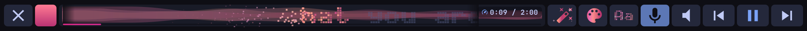
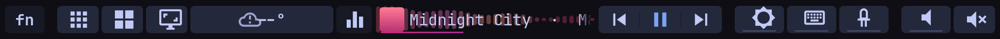
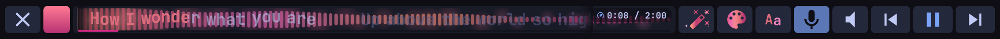
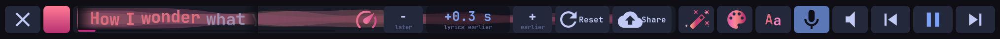
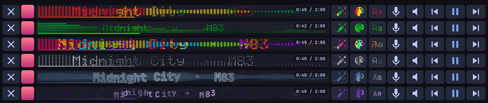
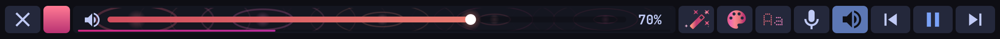
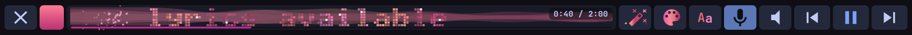

# touchbard 🎤✨

**Turn your MacBook's Touch Bar into a karaoke lyrics player and music visualiser.**

Play anything on **Spotify, YouTube Music, YouTube, [fm.video](https://fm.video)**, or any app that broadcasts its song over MPRIS (most Linux players and every Chromium browser do). Your Touch Bar lights up with the track's artwork, a live equaliser dancing to the actual audio, and **time-synced lyrics that fill in as they're sung**. Words sparkle, bounce to the beat, and burst into sparks as the song moves on. The colours come straight from the song's own artwork.



**🎬 See it running** (a real recording, made with `touchbar-agent record`; click for the full clip with sound):

[](docs/demo.mp4)

There's a short demo on X too: **[karaoke running on a MacBook Touch Bar under Linux](https://x.com/0800tim/status/2105414058254209163)**.

It's a full Touch Bar too, with sliders, weather, F-keys and a Touch ID prompt, for Apple Touch Bar MacBooks running Linux. It has first-class support for [Omarchy](https://omarchy.org) and Hyprland.

## 🎶 The music player

**Now playing, always:** the artwork, the title (which scrolls smoothly when it's long) and a live spectrum behind it. Tap the title to go full screen.



**🎤 Karaoke mode:** tap the mic and the title becomes the song's lyrics, **timed to the music**. The line being sung lights up left to right, the classic karaoke wipe, and the strip glides on to the next line. Lyrics come from [LRCLIB](https://lrclib.net), the free community database fm.video uses, so they work for almost anything you play. Seek, and the lyrics jump with you.



**Lyrics a little off?** Tap the ⏱ time to open the **sync adjuster**. Nudge the lyrics ±0.1 s while you watch them play. The fix is remembered for that song, and **Share** sends it back to LRCLIB so everyone gets the corrected timing.



**A light show, your way.** Three buttons mix three independent choices, all driven by the live audio and its beat:

- **✨ 7 visualisers:** mirrored bars, falling peaks, dots, rainbow **ripples**, flowing **aurora** waves, an LED **pixel** matrix, and a smoky rainbow **comet**.
- **🎨 9 colour moods:**
  - **Music**, which takes its palette from the song's artwork (or live from the video) and crossfades between songs
  - Mono, Smoke, Amethyst, Matrix, Disco and Rasta
  - Rainbow, and your desktop theme
- **Aa 8 text styles:**
  - chunky **dot matrix** and flowing **wave** letters
  - glowing hollow **outline** and a retro **typewriter**
  - drifting **scatter** and beat-lit **blocks**
  - glittering **sparkle** and **explode**, where every pixel twinkles and words burst into sparks after they're sung



**Beat detection:** the title swells, hops and flashes in time with the kick drum, and waves of light roll through the letters on every beat. All of this is only in full screen; the everyday bar stays calm.

**🔊 Volume over the visuals:** the speaker button opens a big volume bar while the light show keeps playing behind it.



**No lyrics for a song?** "No lyrics available" sweeps past in sparkling blocks, then the title returns.



**Seek by dragging** the progress line, which is in fm.video's pink → magenta → purple in the Music mood and follows the mood's colours otherwise.

It's cheap to run: every effect draws in about 1–3 ms a frame, capped at 30 fps and only while something moves.

## 🎛️ The rest of the Touch Bar


- **Control strip:** fn · apps · screenshot · weather · equaliser toggle · now playing · ⏮ ⏯ ⏭ · screen brightness · keyboard light · Touch Bar light · volume · mute. An on-bar Esc appears only on MacBooks without a physical Esc key.
- **Real sliders** for screen brightness, keyboard backlight, the Touch Bar's own backlight, and volume. Tap one and it opens full width, or press and slide straight away as on a Mac.

  

- **F-keys:** tap **fn** on the bar, or hold the physical fn key.

  

- **Touch ID prompt:** when `sudo`, polkit, a password manager or the lock screen asks for your fingerprint, a pulsing fingerprint points at the sensor. It goes green on a match and red on a miss, or shows "Use password" when Touch ID is locked out.

  

- **Weather:** a conditions icon (sun, moon, cloud, fog, rain, sleet, snow, hail, thunderstorm, high wind), the temperature, and a wind arrow in km/h, knots, mph or m/s. Tap it for the next 12 hours. Data comes from [Open-Meteo](https://open-meteo.com), no key needed.

  

- **Theme colours** follow your Omarchy theme live.
- **Optional extras:** a workspaces strip, per-app layers, a clock, battery, and your own buttons for any command or key chord.
- **Plugins:** anything that can print JSON can draw on the bar (see below).
- **🎬 Record it:** the Touch Bar isn't a monitor your screen recorder can see, so touchbard records itself. `touchbar-agent record` captures the bar at full resolution with a soft dot under each finger and whatever's playing, into `~/Videos/touchbar-*.mp4`. Run it again (or Ctrl-C) to stop, or give a length: `touchbar-agent record 20`. Put it on a key or a bar button to toggle it.
- **Power:** it follows the screen brightness, dims after 30 s, turns off after 60 s and on lid close, and a touch wakes it.

## Compatibility

| Machine | Status |
|---|---|
| MacBook Pro 13" M1 (2020, `MacBookPro17,1`) on Asahi / Arch Linux ARM | Daily driver |
| MacBook Pro 13" M2 (2022, `Mac14,7`) | Should work (same display and digitiser path); untested |
| Intel T2 MacBook Pros (2018–2020, `appletbdrm`) | Supported in code (backlight and digitiser names); untested |

touchbard finds the Touch Bar by shape (a connected DRM panel far taller than wide) and the digitiser by touch capability, and lays out to whatever width the panel reports.

## Requirements

- **[tiny-dfr](https://github.com/AsahiLinux/tiny-dfr) installed.** touchbard replaces its daemon but relies on its udev rules, which put the Touch Bar on its own seat and name the devices. The installer masks `tiny-dfr.service`.
- Rust (to build), cairo, pango, libinput.
- The agent needs Python 3.11+ with PyGObject, plus `wpctl`/`pactl`, and `brightnessctl` for the sliders.
- Optional: `cava` (equaliser), `hyprctl` (workspaces, per-app layers), fprintd (Touch ID prompt).

On Arch: `pacman -S --needed rust cairo pango libinput python-gobject brightnessctl cava`

## Install

**Omarchy:** install it as a plugin, then click the Touch Bar icon it adds to your bar to build and install:

```bash
omarchy plugin add https://github.com/0800tim/touchbard --enable
```

The installer runs in a terminal so you see each step. It installs missing packages from the official repos (`rust cairo pango libinput python-gobject brightnessctl cava tiny-dfr`), builds in `~/.cache/touchbard`, and asks for sudo to install the system service. After that, the bar icon opens your Touch Bar config (left-click), toggles the equaliser (right-click) and restarts the agent (middle-click). Remove it with `omarchy plugin remove io.github.0800tim.touchbard` plus the uninstall step below.

**Manually:**

```bash
git clone https://github.com/0800tim/touchbard && cd touchbard
(cd daemon && cargo build --release)
sudo system/install.sh        # replaces tiny-dfr's daemon; rolls back by itself if touchbard fails to start
install -Dm644 system/touchbar-agent.service ~/.config/systemd/user/touchbar-agent.service
systemctl --user daemon-reload && systemctl --user enable --now touchbar-agent
```

Omarchy users can repaint instantly on theme changes with `omarchy hook install theme-set system/hooks/touchbar-reload`. The agent also notices by itself within a couple of seconds.

To uninstall: `sudo system/uninstall.sh` (puts tiny-dfr back; it removes only files recorded in the install manifest whose checksums still match), then `systemctl --user disable --now touchbar-agent`.

## Configure

Everything lives in `~/.config/touchbar/config.toml`, created on first run and applied as you save. The file documents every option. Some examples:

```toml
[settings]
nowplaying = "bars"      # behind the track title: "bars", "art" or "off"

[theme]
background = "#000000"   # true black, as on macOS
accent = "magenta"       # or any theme colour name / hex

[layers.control]
items = [
  "esc", "fn", "gap",
  { icon = "󰈹", command = "firefox" },
  { label = "Build", command = "cd ~/code/app && make", width = 120 },
  { icon = "󰆏", keys = ["LeftCtrl", "C"] },
  "flex", "eq", "nowplaying", "media", "gap",
  "brightness", "keyboard", "gap", "volume", "mute",
]

[apps]                   # per-app layers, by window class (regex)
"code|kitty" = "dev"
```

`touchbar-agent --dump-layout` shows the expanded result. `touchbard --preview out.png layout.json theme.json volume=0.5 finger=scan` renders a frame to a PNG, for designing without the hardware.

## How it works

| Part | Runs as | Job |
|---|---|---|
| `touchbard` (Rust) | system service, from boot | owns the Touch Bar's DRM panel and digitiser; draws with cairo/pango; sends keys through a uinput device; manages the backlight. Drops to `nobody` (groups `input`, `video`) after opening its devices. |
| `touchbar-agent` (Python) | systemd user service | reads the theme and config; tracks volume, brightness, MPRIS, Hyprland and fprintd; runs button commands; hosts plugins |

They talk over `/run/touchbard/touchbard.sock`, one JSON object per line. Layouts can carry commands that run in your session, so the daemon only talks to the user who owns the active session on seat0 (from logind; checked by peer credentials on connect and before every message), and the agent only acts on a socket whose peer is root or the daemon's unprivileged `nobody`. Until an agent connects (for example at the login screen), the daemon shows a key-only fallback layout.

Notes for anyone hacking on the display path:
- Apple's `adp` display engine reads rows padded to 64 bytes. A 60 px wide dumb buffer gets a 240-byte pitch from the kernel and shows a sheared image, so allocate 64 px wide.
- fprintd emits `VerifyFingerSelected` and `VerifyStatus`, but no signal when a scan is abandoned. The prompt clears on Enter or after 35 s.

## Plugins

A plugin is a folder with a `plugin.toml` and an executable:

```toml
name = "cava"
description = "Live audio spectrum"
exec = "plugin.py"
background = "playing"   # optional: run whenever music plays
```

The agent runs it and talks over stdin/stdout, one JSON object per line:

- **In:** `{"t":"size","w","h","options"}`, `{"t":"theme",…}`, `{"t":"media","title","artist","position","length","playing",…}`, `{"t":"cmd","cmd":"tap"|"next","x"}`
- **Out:** `{"t":"bars","v":[0..1,…]}`, `{"t":"state",…}`, `{"t":"log","msg"}`, or `{"t":"frame","w","h","len"}` followed by `len` bytes of BGRA to draw on a surface

Put it on the bar with `{ plugin = "name", width = 400 }`. Install someone else's with `touchbar-agent plugin add <git-url> <commit-sha>` (pinned to that exact commit, since plugins run as you), and list them with `touchbar-agent plugin list`. Keep frames small or infrequent: the socket carries every byte.

## Credits

The udev rules and the idea of owning the Touch Bar over DRM come from [tiny-dfr](https://github.com/AsahiLinux/tiny-dfr) by the Asahi Linux project. touchbard is a separate program, not a fork. Icons are [Nerd Fonts](https://www.nerdfonts.com) Material Design glyphs.

## License

MIT
