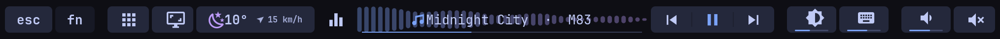
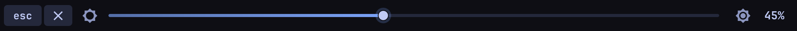
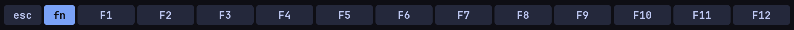
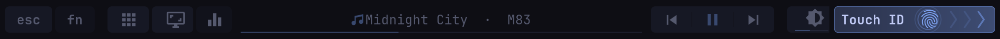
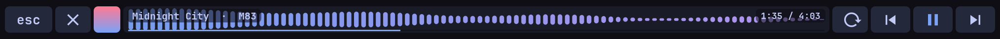
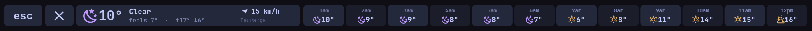

# touchbard

A themed, macOS-style Touch Bar for Apple Touch Bar MacBooks running Linux. It has sliders, a live equaliser, a Touch ID prompt that points at the sensor, and colours that follow your desktop theme. It has first-class support for [Omarchy](https://omarchy.org) and Hyprland, and works without them.



## What you get

- **Control strip:** esc · fn · apps · screenshot · weather · equaliser toggle · now playing · ⏮ ⏯ ⏭ · screen brightness · keyboard light · volume · mute.
- **Real sliders** for brightness, keyboard backlight and volume. Tap one and it opens full width, or press and slide straight away as on a Mac. A hairline under each button shows the current level.

  

- **F-keys:** tap **fn** on the bar to switch, or hold the physical fn key.

  

- **Touch ID prompt:** when `sudo`, polkit, a password manager or the lock screen asks fprintd for a finger, the right end shows a pulsing fingerprint with chevrons running towards the sensor. It turns green on a match, shakes on a retry and goes red on a failure.

  

- **Music:** a live equaliser ([cava](https://github.com/karlstav/cava)) or the album cover behind the track title, with a button to switch the equaliser off. Tap the title for a full-width equaliser with a drag-to-seek scrubber, via MPRIS, so it works with any player.

  

- **Weather:** conditions icon (sun, moon, cloud, fog, drizzle, rain, sleet, snow, hail, thunderstorm, high wind), temperature, and a wind arrow with the speed in km/h, knots, mph or m/s. Tap it for feels-like, today's range and the next 12 hours. Data comes from [Open-Meteo](https://open-meteo.com) (no key needed). Units follow the location's country unless you set them.

  

- **Theme colours:** read from the current Omarchy theme, updated live when the theme changes. Elsewhere it uses a Tokyo Night palette, and you can override any colour.
- **Workspaces strip, per-app layers** (switch layout by focused window) and a **clock and battery**, all optional.
- **Plugins:** anything that can print JSON can draw on the bar (see below).
- **Power:** follows the screen brightness, dims after 30 s, turns off after 60 s and on lid close. A touch wakes it without triggering anything.

## Compatibility

| Machine | Status |
|---|---|
| MacBook Pro 13" M1 (2020, `MacBookPro17,1`) on Asahi / Arch Linux ARM | Daily driver |
| MacBook Pro 13" M2 (2022, `Mac14,7`) | Should work (same display and digitiser path); untested |
| Intel T2 MacBook Pros (2018–2020, `appletbdrm`) | Supported in code (backlight and digitiser names); untested |

touchbard finds the Touch Bar by shape (a connected DRM panel far taller than wide) and the digitiser by touch capability, and lays out to whatever width the panel reports.

## Requirements

- **[tiny-dfr](https://github.com/AsahiLinux/tiny-dfr) installed.** touchbard replaces its daemon but relies on its udev rules, which put the Touch Bar on its own seat and name the devices. The installer masks `tiny-dfr.service`.
- Rust (to build), cairo, pango, libinput.
- The agent needs Python 3.11+ with PyGObject, plus `wpctl`/`pactl`, and `brightnessctl` for the sliders.
- Optional: `cava` (equaliser), `hyprctl` (workspaces, per-app layers), fprintd (Touch ID prompt).

On Arch: `pacman -S --needed rust cairo pango libinput python-gobject brightnessctl cava`

## Install

**Omarchy:** install it as a plugin, then click the Touch Bar icon it adds to your bar to build and install:

```bash
omarchy plugin add https://github.com/0800tim/touchbard --enable
```

The installer runs in a terminal so you see each step. It installs missing packages from the official repos (`rust cairo pango libinput python-gobject brightnessctl cava tiny-dfr`), builds in `~/.cache/touchbard`, and asks for sudo to install the system service. After that, the bar icon opens your Touch Bar config (left-click), toggles the equaliser (right-click) and restarts the agent (middle-click). Remove it with `omarchy plugin remove io.github.0800tim.touchbard` plus the uninstall step below.

**Manually:**

```bash
git clone https://github.com/0800tim/touchbard && cd touchbard
(cd daemon && cargo build --release)
sudo system/install.sh        # replaces tiny-dfr's daemon; rolls back by itself if touchbard fails to start
install -Dm644 system/touchbar-agent.service ~/.config/systemd/user/touchbar-agent.service
systemctl --user daemon-reload && systemctl --user enable --now touchbar-agent
```

Omarchy users can repaint instantly on theme changes with `omarchy hook install theme-set system/hooks/touchbar-reload`. The agent also notices by itself within a couple of seconds.

To uninstall: `sudo system/uninstall.sh` (puts tiny-dfr back), then `systemctl --user disable --now touchbar-agent`.

## Configure

Everything lives in `~/.config/touchbar/config.toml`, created on first run and applied as you save. The file documents every option. Some examples:

```toml
[settings]
nowplaying = "bars"      # behind the track title: "bars", "art" or "off"

[theme]
background = "#000000"   # true black, as on macOS
accent = "magenta"       # or any theme colour name / hex

[layers.control]
items = [
  "esc", "fn", "gap",
  { icon = "󰈹", command = "firefox" },
  { label = "Build", command = "cd ~/code/app && make", width = 120 },
  { icon = "󰆏", keys = ["LeftCtrl", "C"] },
  "flex", "eq", "nowplaying", "media", "gap",
  "brightness", "keyboard", "gap", "volume", "mute",
]

[apps]                   # per-app layers, by window class (regex)
"code|kitty" = "dev"
```

`touchbar-agent --dump-layout` shows the expanded result. `touchbard --preview out.png layout.json theme.json volume=0.5 finger=scan` renders a frame to a PNG, for designing without the hardware.

## How it works

| Part | Runs as | Job |
|---|---|---|
| `touchbard` (Rust) | system service, from boot | owns the Touch Bar's DRM panel and digitiser; draws with cairo/pango; sends keys through a uinput device; manages the backlight. Drops to `nobody` (groups `input`, `video`) after opening its devices. |
| `touchbar-agent` (Python) | systemd user service | reads the theme and config; tracks volume, brightness, MPRIS, Hyprland and fprintd; runs button commands; hosts plugins |

They talk over `/run/touchbard/touchbard.sock`, one JSON object per line. Until an agent connects (for example at the login screen), the daemon shows a key-only fallback layout.

Notes for anyone hacking on the display path:
- Apple's `adp` display engine reads rows padded to 64 bytes. A 60 px wide dumb buffer gets a 240-byte pitch from the kernel and shows a sheared image, so allocate 64 px wide.
- fprintd emits `VerifyFingerSelected` and `VerifyStatus`, but no signal when a scan is abandoned. The prompt clears on Enter or after 35 s.

## Plugins

A plugin is a folder with a `plugin.toml` and an executable:

```toml
name = "cava"
description = "Live audio spectrum"
exec = "plugin.py"
background = "playing"   # optional: run whenever music plays
```

The agent runs it and talks over stdin/stdout, one JSON object per line:

- **In:** `{"t":"size","w","h","options"}`, `{"t":"theme",…}`, `{"t":"media","title","artist","position","length","playing",…}`, `{"t":"cmd","cmd":"tap"|"next","x"}`
- **Out:** `{"t":"bars","v":[0..1,…]}`, `{"t":"state",…}`, `{"t":"log","msg"}`, or `{"t":"frame","w","h","len"}` followed by `len` bytes of BGRA to draw on a surface

Put it on the bar with `{ plugin = "name", width = 400 }`. Install someone else's with `touchbar-agent plugin add <git-url> <commit-sha>` (pinned to that exact commit, since plugins run as you), and list them with `touchbar-agent plugin list`. Keep frames small or infrequent: the socket carries every byte.

## Credits

The udev rules and the idea of owning the Touch Bar over DRM come from [tiny-dfr](https://github.com/AsahiLinux/tiny-dfr) by the Asahi Linux project. touchbard is a separate program, not a fork. Icons are [Nerd Fonts](https://www.nerdfonts.com) Material Design glyphs.

## License

MIT
